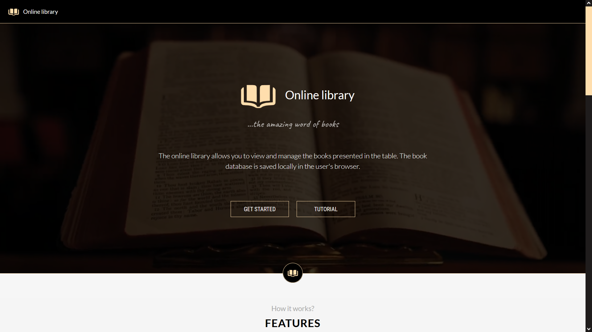
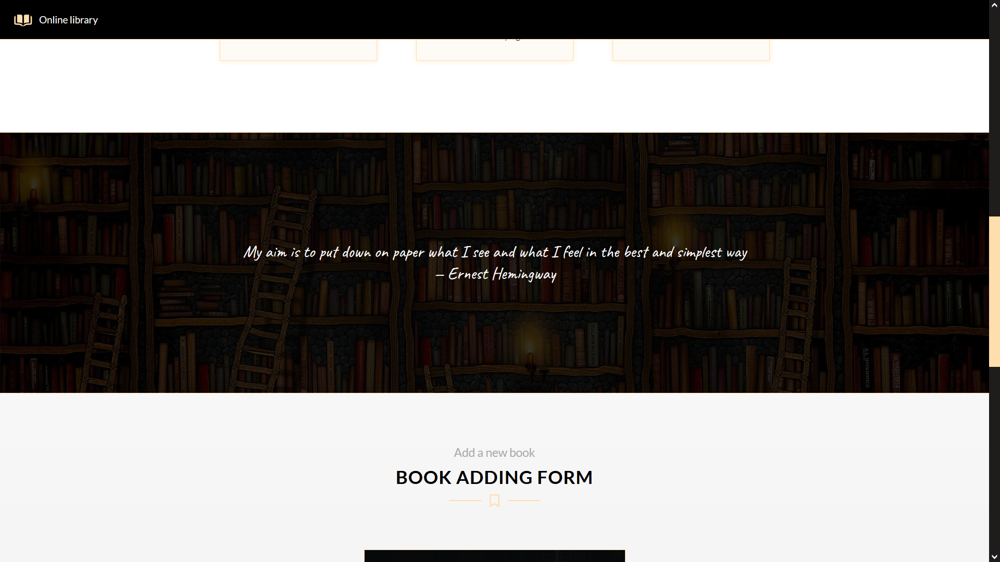
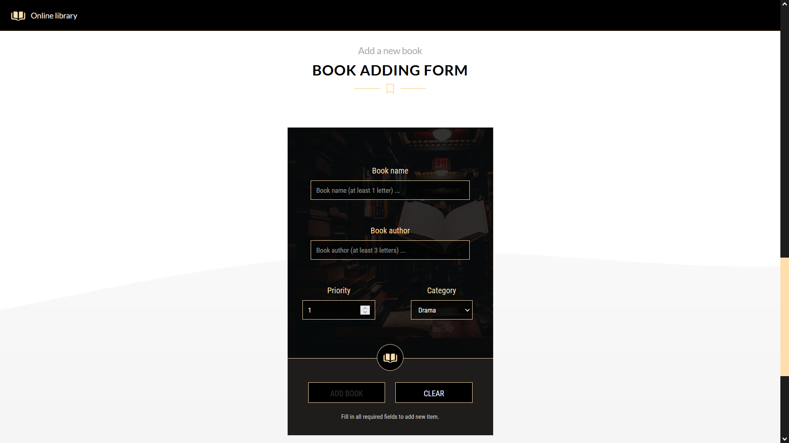
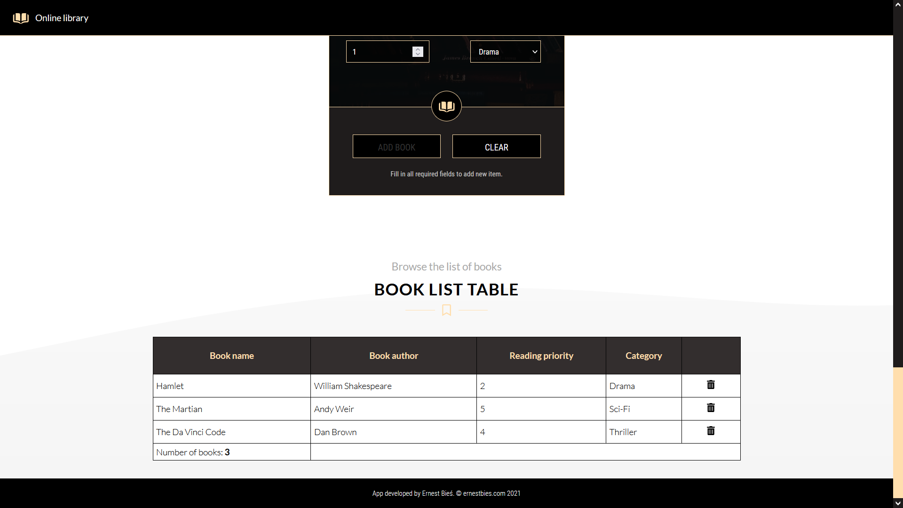

# Online library

Online library created with JavaScript, HTML and CSS only. The application allows you to create your own book library. The data is saved in localStorage. The book can be added by filling out the form on the website. The presented table contains a list of all books and the possibility of deleting a particular item.

1. Homepage

2. Features

3. Page

4. Form

5. Table

